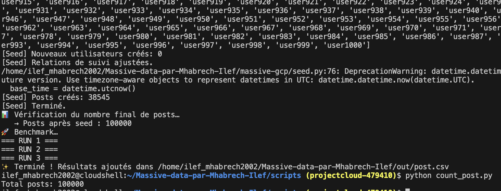
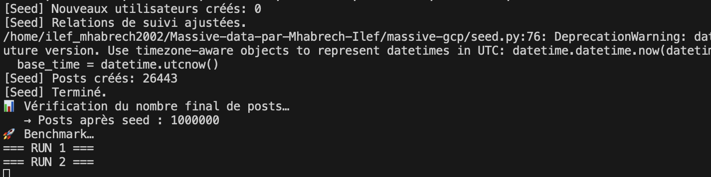
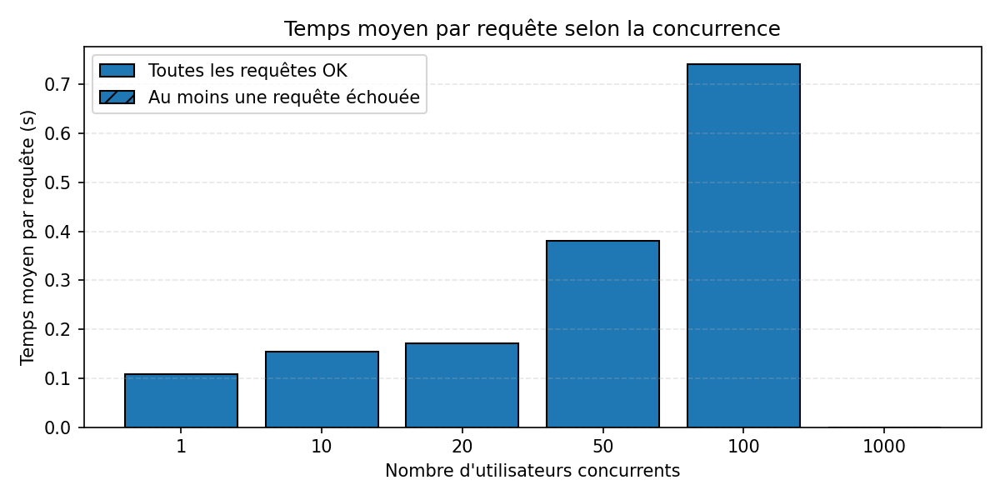
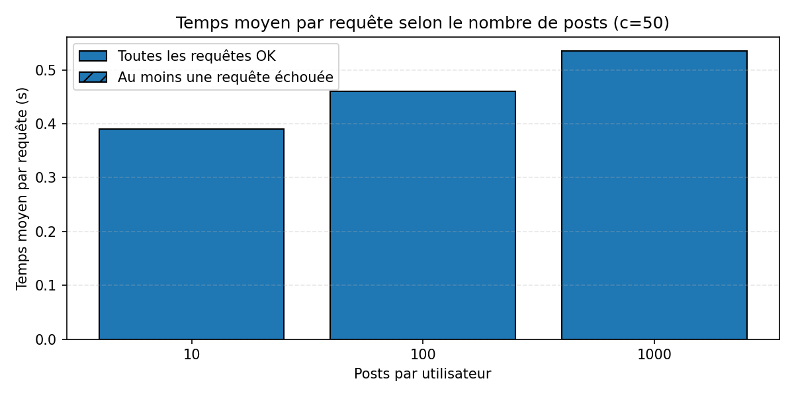
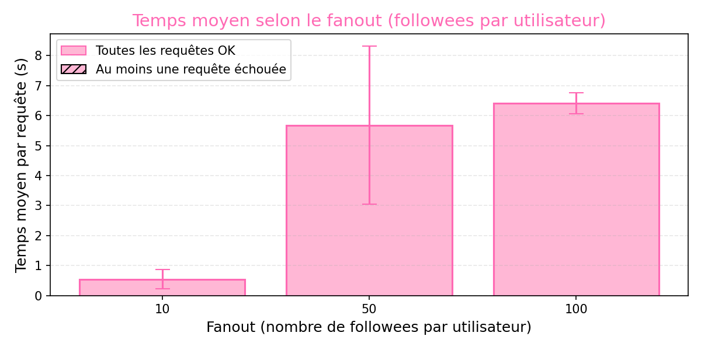

# Massive-data-par-Mhabrech-Ilef

### Projet Données Massives & Cloud — Benchmark TinyInsta 
Ce projet réalise trois benchmarks sur l’application TinyInsta, déployée sur Google Cloud App Engine et utilisant Google Datastore comme base NoSQL.<br>
Les objectifs :<br>
mesurer la scalabilité sur la concurrence,<br>
la scalabilité sur la taille des données,<br>
la scalabilité sur le fanout (nombre de followees).<br>

### 1. Application TinyInsta déployée
URL de l'application TinyInsta déployée sur Google Cloud :
```sh
 https://projectcloud-479410.ew.r.appspot.com
```

### 2. Génération des données (seed)
Les premières données ont été générées dans Datastore avec :
1000 utilisateurs
50 000 posts
20 followees par utilisateur

Commande utilisée la première fois : 
```sh
python3 seed.py \
  --users 1000 \
  --posts 50000 \
  --follows-min 20 \
  --follows-max 20 \
  --prefix user

  ```
Les données seedées sont visibles dans GCP → Datastore.

### 3.  Benchmark 1 – Passage à l’échelle sur la concurrence

* Objectif : 
Mesurer la performance de la timeline en faisant varier le nombre d’utilisateurs simulés simultanément :
1, 10, 20, 50, 100, 1000 utilisateurs concurrents . 

▶Exécution du benchmark Depuis la racine du projet pour génerer un fichier conc.csv:

```sh
cd scripts/ 
chmod +x generate_conc.sh
./generate_conc.sh
```

▶ Résultats dans :
```
out/conc.csv
out/log_conc/*.log
```
▶ géneration du fichier conc.png :

```sh
python3 plot_conc.py
```

▶Fichiers générés :
```
out/conc.png
```

### 4. Benchmark 2 – Passage à l’échelle sur la taille des données (posts)
Paramètres : <br>
Concurrence : 50<br>
Followees fixes : 20<br>
Varier le nombre de posts par user :<br>
10, 100, 1000<br>

Remarque : 
2 fichiers sont utilisés : 
| Cas                       | Script              | Description                                   |
| ------------------------- | ------------------- | --------------------------------------------- |
| **10 posts/user**         | generate_post_10.sh | Reset complet + 10 000 posts                  |
| **100 / 1000 posts/user** | generate_post.sh    | Ajout intelligent du nombre manquant de posts |


▶ Génération pour 10 posts/user (Reset complet) : 
```sh 
chmod +x generate_post_10.sh
cd scripts/ 
bash generate_post_10.sh 10 
```
Génère exactement 10 000 posts.

▶ Génération pour 100 et 1000 posts/user
```sh 
chmod +x generate_post.sh
bash scripts/generate_post.sh 100
bash scripts/generate_post.sh 1000
```
Le script :
détecte le nombre de posts existants,
génère seulement les posts manquants,
évite de refaire le seed complet.

▶Fichiers générés :
```
out/post.csv
out/log_post/*.log
```
▶ preuves que j'avais crée : 
##### 100 000 posts : 

##### 1 M de posts : 



▶ Générer le graphique
```sh
python3 scripts/plot_post.py
```

▶Fichiers générés :
```
out/post.png
```
### 5. Benchmark 3 – Variation du fanout (nombre de followees)

Concurrence fixe : 50<br>
Posts fixes : 100*1000 users <br>
Followees à tester :<br>
10, 50, 100<br>

 on prépare d'abord la data, on crée 100 000 posts pour le fichier fanout.csv.
▶on lance : 
```sh
chmod +x prepare_fanout_data.sh
./scripts/prepare_fanout_data.sh
```

▶on lance cette commande pour avoir le fichier fanout.csv :

```sh
chmod +x generate_fanout.sh
./scripts/generate_fanout.sh
```

▶Générer le graphique : 

```sh
python3 scripts/plot_fanout.py
```

Fichiers générés :
```
out/fanout.csv
out/fanout.png
out/log_fanout/*.log
```

### 7. verification des données dans la data store : 
#### A. nombre des users : 
pour savoir le nombre des users dans la data store on utilisie la commande : 
```
cd scripts/ 
python3 count_users.py
```
#### B. nombre des posts : 
pour savoir le nombre des posts dans la data store on utilisie la commande :
```
cd scripts/ 
python3 count_posts.py
```

### 8.  Interprétation : 
## A. Graphique – Concurrence


Interprétation : 
Le système scale correctement jusqu’à ~20 utilisateurs concurrents.
À 50 utilisateurs, la latence devient perceptible mais acceptable.
À 100 utilisateurs, la performance commence réellement à se dégrader.
À 1000 utilisateurs, le service reste fonctionnel mais montre une dégradation sévère (temps × 20 par rapport à la charge faible).

==>TinyInsta est beaucoup plus sensible à la concurrence qu’à la quantité de données.
Le backend supporte correctement une faible concurrence mais devient très lent lorsque le nombre d’utilisateurs simultanés augmente.
La concurrence est le facteur de performance le plus critique pour TinyInsta, bien plus que la quantité de données.

 L

## B. Graphique – Nombre de posts


Interprétation : 
L’augmentation du nombre de posts par utilisateur impacte les performances :
Avec 10 posts/user, les performances sont correctes mais instables.
Avec 100 posts/user, le temps augmente modérément mais des erreurs apparaissent.
Avec 1000 posts/user, la majorité des runs échouent : Datastore atteint ses limites.

==> Le backend TinyInsta ne gère pas bien les très gros volumes de posts, surtout lorsque plusieurs timelines doivent fusionner des données au même moment.La taille des données provoque surtout de l’instabilité et des erreurs, mais pas une explosion massive du temps de réponse tant que le run passe.

## C. Graphique – Fanout


nterprétation :

L’augmentation du fanout dégrade fortement les performances :
Fanout = 10 : temps moyen faible (~0,5 s), service fluide.
Fanout = 50 : temps moyen autour de 5–6 s, apparition de timeouts → le backend commence à saturer.
Fanout = 100 : temps encore très élevé (~6–7 s), le système est déjà en surcharge et n’arrive plus vraiment à suivre.

==>TinyInsta supporte bien les petits fanouts, mais dès que les utilisateurs suivent beaucoup de comptes, la construction de la timeline devient trop coûteuse (lectures + fusion dans Datastore), ce qui provoque une forte hausse de latence et des timeouts.

### 8. structure du répertoire : 


```

```


